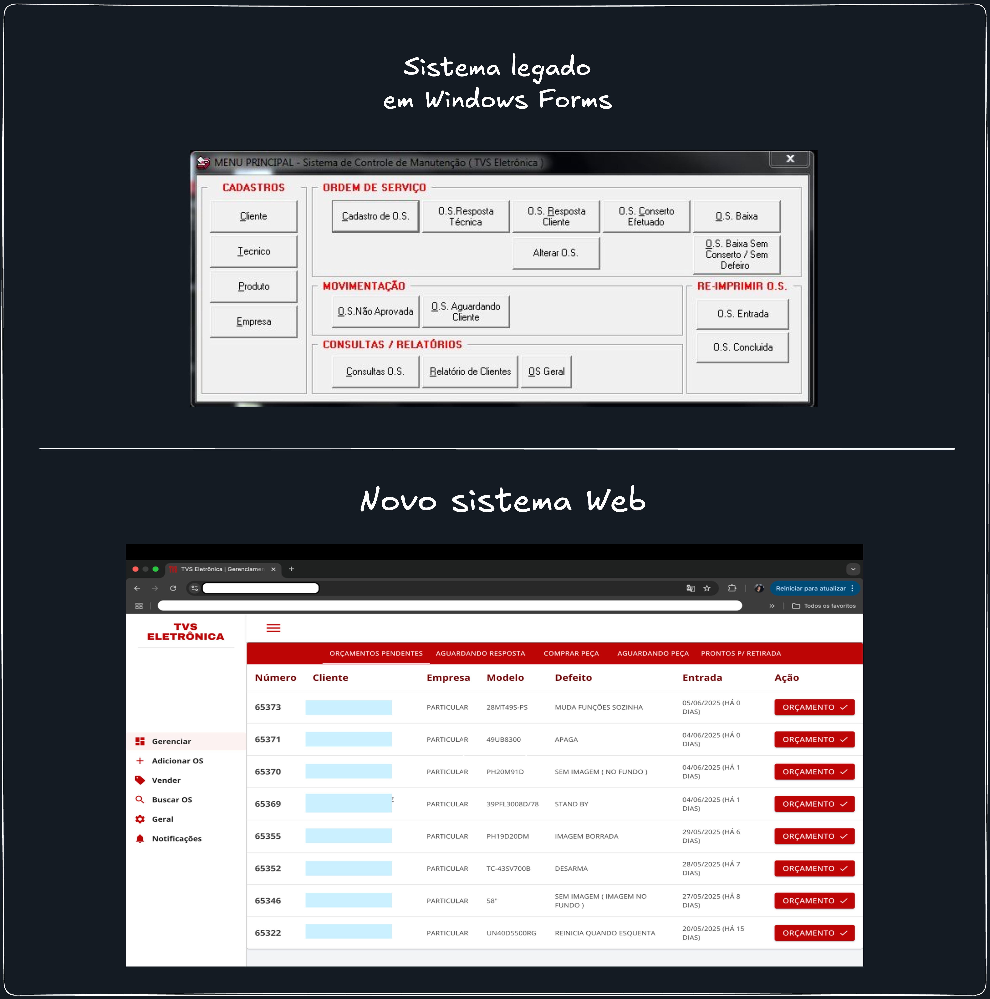

<h2>Sobre o projeto</h2>

    Este projeto foi desenvolvido para a empresa <strong>TVS Eletrônica</strong> com o objetivo de modernizar e otimizar
    o gerenciamento de clientes e ordens de serviço.

    Anteriormente, a empresa utilizava um sistema desktop legado, criado com <strong>Windows Forms</strong> em 2003, 
    que não atendia mais às necessidades atuais:

<ol>
    <li>Sistema restrito a uma única máquina com <strong>Windows 7</strong>.</li>
    <li>Armazenamento de dados local em <strong>Microsoft Access</strong>, oferecendo baixo nível de segurança.</li>
    <li>Dificuldade de acesso simultâneo por múltiplos funcionários.</li>
</ol>

    Diante desse cenário, realizei a <strong>reengenharia completa</strong> do sistema, migrando de uma aplicação desktop para uma 
    <strong>aplicação web</strong>. O novo sistema permite múltiplos acessos simultâneos e armazena os dados de forma segura em um 
    banco de dados <strong>SQL Server</strong>, hospedado na <strong>Azure</strong>.

Este sistema foi desenvolvido utilizando as seguintes tecnologias e padrões:

<ul>
    <li>
        <strong>C# .NET Core</strong>: plataforma principal para desenvolvimento da API REST, garantindo alta performance,
        segurança e escalabilidade para o backend.
    </li>
    <li>
        <strong>Entity Framework Core</strong>: ORM (Object-Relational Mapping) utilizado para simplificar o acesso e manipulação
        do banco de dados SQL Server, permitindo a abstração de queries complexas e facilitando a manutenção do código.
    </li>
    <li>
        <strong>QuestPDF</strong>: biblioteca utilizada para a geração de documentos PDF, responsável pela criação automatizada de
        comprovantes de ordens de serviço e certificados de garantia, garantindo padronização e eficiência na emissão desses documentos.
    </li>
    <li>
        <strong>Blazor WebAssembly (WASM)</strong>: tecnologia de frontend utilizada para criar uma aplicação web moderna,
        interativa e executada diretamente no navegador, sem necessidade de plugins, utilizando a linguagem C#.
    </li>
</ul>

    O sistema foi desenvolvido utilizando <strong>Clean Architecture</strong>, com princípios de <strong>Domain-Driven Design (DDD)</strong>, 
    visando a separação clara de responsabilidades e o foco no domínio de negócios.
    Além disso, foi adotado o padrão <strong>Command Query Separation (CQS)</strong> para organizar as operações, distinguindo 
    claramente os fluxos de leitura e escrita, resultando em um código mais coeso e de fácil manutenção.

